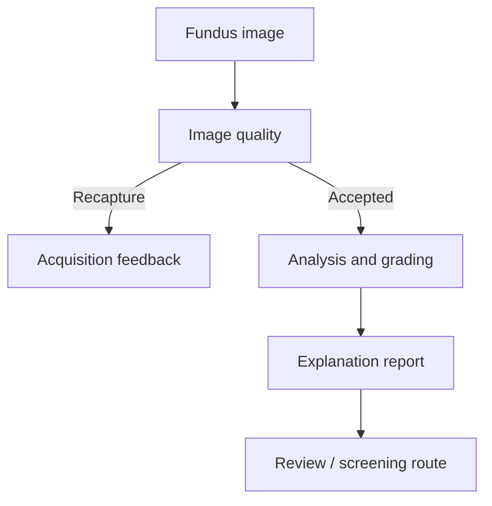

# NetrAI

**Explainable diabetic retinopathy screening for rural care settings**

SIH 2026 · Problem Statement 26038 · Team Biscuit · MathWorks-sponsored challenge

NetrAI combines a MATLAB screening pipeline with a SimEvents model of district
screening capacity. The prototype helps an operator assess image quality, produces
severity and referral outputs, and generates an annotated report for review.
The simulation explores how connectivity, staffing and recapture demand affect
screening completion.

[Run the prototype](matlab/README_MATLAB.md) · [Validation evidence](docs/VALIDATION.md) · [Demo guide](docs/DEMO.md) · [Model card](docs/MODEL_CARD.md)

## Screening workflow



| Component | Implemented capability |
| --- | --- |
| Image quality | Focus, illumination and field-of-view checks with recapture feedback |
| Retinal analysis | Optic-disc/fovea localization, vessels and lesion candidate overlays |
| DR grading | Trained EfficientNet-B4 ONNX inference with five-grade and referral output heads |
| Explanation report | Referral-targeted Grad-CAM, evidence checklist and PDF report |
| District simulation | SimEvents acquisition, upload, processing and review queues |

The grade and referral heads share a backbone. Disagreeing outputs route to
human review. The capacity simulation is a separate planning model.

## Prototype and results

All five component categories are implemented. Validation is ongoing; NetrAI is
a research prototype and has not been clinically validated.

| Evaluation | Recorded result | Interpretation |
| --- | --- | --- |
| MATLAB model execution | 733/733 images processed; zero processing errors | Internal development run |
| Internal referable-DR grading | Sensitivity 94.97%, specificity 93.33%, QWK 0.9297 | Training overlap affects this cohort; not independent accuracy evidence |
| Model execution time | Mean 1.55 s/image | Model-only CPU timing; excludes report generation and clinician review |
| SimEvents capacity analysis | 18 bandwidth/staffing/quality scenarios | Simulated outcomes under declared assumptions |

The internal cohort includes **35 images with exact-content counterparts in
training** and informed model/policy selection. External-domain development
results remain below screening acceptance targets. See the
[validation report](docs/VALIDATION.md) for sample sizes, artifact links and open gates.

In the one-clinician scenario with 10% assumed quality rejection, simulated
completion was 32.14% at 0.25 Mbps and 89.99% at 1 Mbps. Recapture requests remain
unresolved. These figures describe simulation behavior, not observed field impact.

## Run in MATLAB

The tested environment is **MATLAB R2026a Update 5**. Image inference requires
Deep Learning Toolbox, Image Processing Toolbox and the Deep Learning Toolbox
Converter for ONNX Model Format support package. M5 also requires Simulink and
SimEvents. No local GPU is required.

Clone the repository, open its `matlab` folder, and enter these commands in the
**MATLAB Command Window**:

```matlab
fixtureReport = verifyMatlabPackage();
result = demo_netrai("/absolute/path/to/fundus.png");
```

Supply a local image whose terms permit your intended use. Images and datasets
are not bundled. Accepted images produce a report; rejected images produce
recapture feedback. Each demo run uses a new output directory.

To inspect the capacity model:

```matlab
open_system('models/NetrAI_Telemedicine_Model.slx')
```

See [MATLAB setup and batch validation](matlab/README_MATLAB.md) for detailed instructions.

On Linux, you can launch the demonstration from a **terminal** at the repository root:

```bash
./scripts/launch_demo.sh /absolute/path/to/fundus.png
```

The launcher opens MATLAB, runs the image demonstration and opens the SimEvents
model. MATLAB expressions such as `result = demo_netrai(...)` belong in MATLAB's
Command Window; they cannot be entered directly into Bash.

## Scope and next steps

Lesion overlays are candidate detections, and Grad-CAM visualizes model
attribution. Neither is proof of a confirmed lesion. Portable-camera robustness,
fresh external grading, full runtime equivalence and clinician explanation/review-time
studies remain open. Next work focuses on these validation gaps and a complete
recapture-return workflow in the capacity simulation.

## Repository guide

- [`matlab/`](matlab/README_MATLAB.md): primary screening implementation, deployment artifacts and SimEvents model.
- [`docs/`](docs/VALIDATION.md): validation, model documentation and demonstration instructions.
- [`results/`](results/README.md): organized benchmark evidence with dates, runtime and limitations.
- [`data/README.md`](data/README.md): dataset sources, layout and usage terms.
- [`research/`](research/README.md): model-training provenance.

## License and contributions

Original project source and documentation use the [MIT License](LICENSE).
Models, datasets, image fixtures and third-party components retain separate
terms; see [licensing scope](LICENSE_STATUS.md).
Contributions should include reproducible evidence and respect these boundaries.
See [CONTRIBUTING.md](CONTRIBUTING.md).
